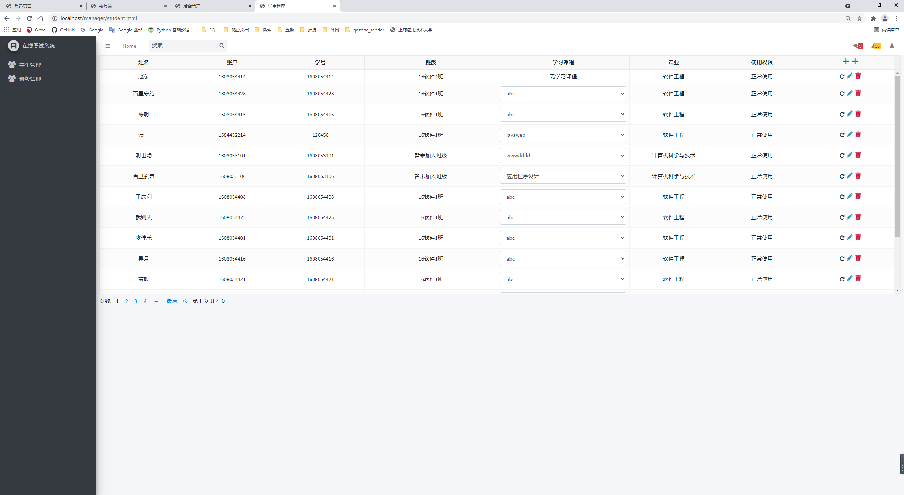
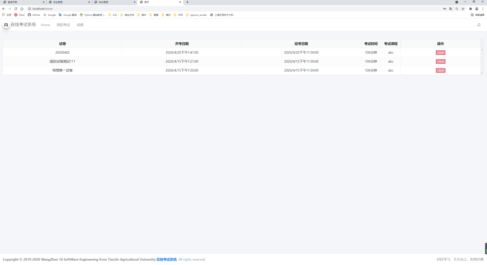
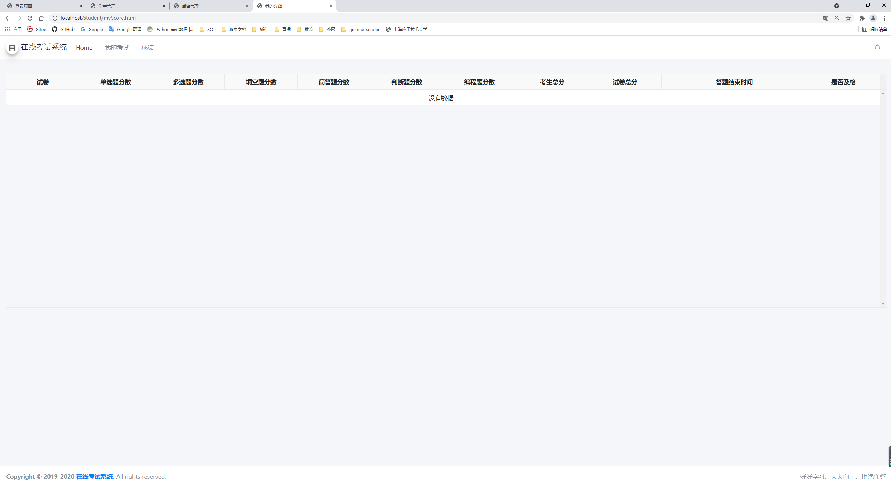
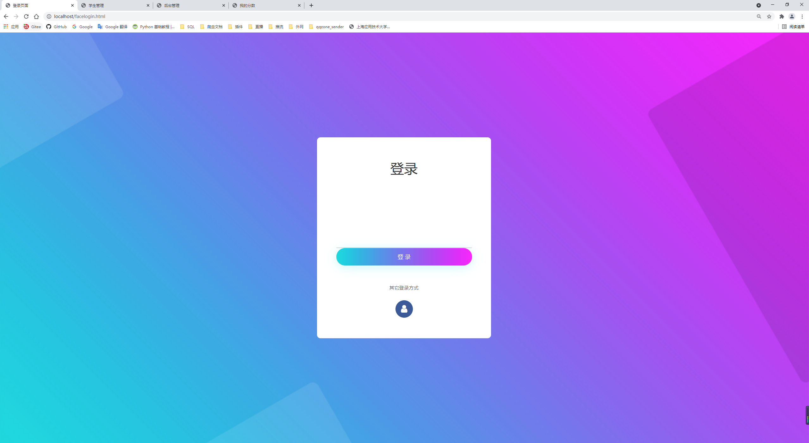
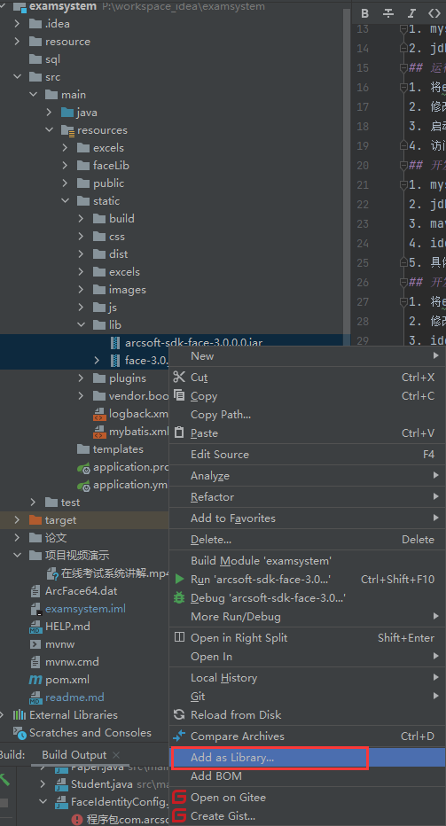
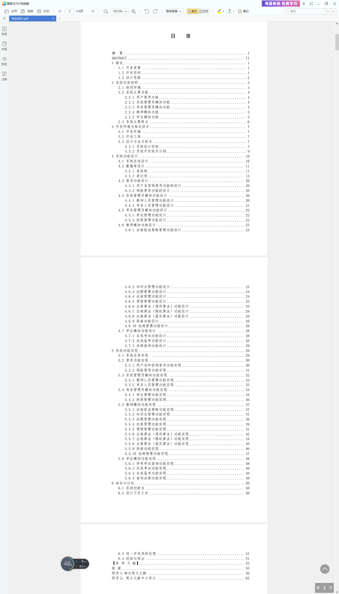

# 开源项目-基于SpringBoot的在线考试系统
## 项目运行截图
1. 登录截图
    
2. 教师首页截图
    
3. 管理员首页截图
    
4. 考务管理员-学生管理首页截图
    
5. 学生首页截图
    
    
6. 人脸识别登录 
    因本台式机无摄像头，因此此时截图没有看到摄像头，想看具体演示请转 项目视频演示/在线考试系统讲解.mp4
    
## 示例账号密码
1. 学生 1608054401/111
2. 管理员 admin/111
3. 教师 1677688026/111
4. 考务 manager/111
## 技术构成
1. springboot
2. spring
3. spring security
4. jquery
5. adminlte 前端模板 基于bootstrap
6. 一堆js插件，差不多都是bootstrap的
7. 虹软人脸识别开发包
8. pdf试卷生成
9. mysql
## 运行要求的必备环境
1. mysql8
2. jdk11
## 运行部署方法
1. 将examsystem.sql 部署到mysql8
2. 修改application.yml文件
3. 启动 java -jar jar包名      (可以直接使用start.bat)
4. 访问localhost:8080
## 开发要求的必备环境
1. mysql8
2. jdk11
3. maven 3.7
4. idea
5. 具体依赖，请自行查看pom文件
## 开发部署方法
1. 将examsystem.sql 部署到mysql8
2. 修改application.yml文件
3. idea中启动
4. 访问localhost:8080
## application.yml文件修改提示
1. 数据库账号密码记得改
2. 默认端口号是80（不是8080）
3. arcsoft-static-paramter底下的变量要配置好，其中faceEngineLibPath指向你resources/faceLib/*的绝对目录
4. upload-static-paramter底下的路径，共三个，faceFolderlocalPath、problemFolderLocalPath、examFaceDetectLocalPath、要确保你的系统中存在这些路径
## 重要提示
1. resources/faceLib/*是虹软人脸识别所需的dll包，没有这些包，系统中的人脸识别将会无法启动，同时还应在application.yml中正确配置开发包的绝对路径
2. resources/static/lib/*下有1个jar也要加到项目的构建路径中 图中是2个，实际是1个，图错了懒得换了
   
3. The server time zone value '�й���׼ʱ��' is unrecognized or represents more than one time zone. You must configure either the server or JDBC driver (via the serverTimezone configuration property) 
    数据库时区错误，执行 SQL: set global time_zone = '+8:00'

## 项目论文
项目自带论文，在根目录下，可自行查看 项目论文目录截图

## 如果我的项目出现问题，请发[Issue](https://gitee.com/WangZhenCoder/examsystem/issues)
## 项目releases版没有，gitee限制上传100MB的文件，releases版105MB...
## 项目视频讲解不上传了，115MB上传不了。。

